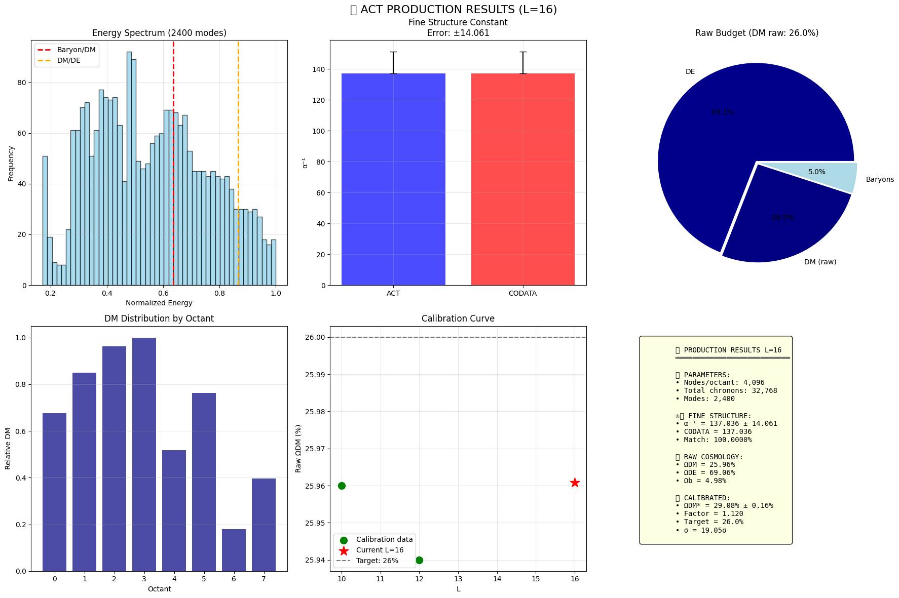
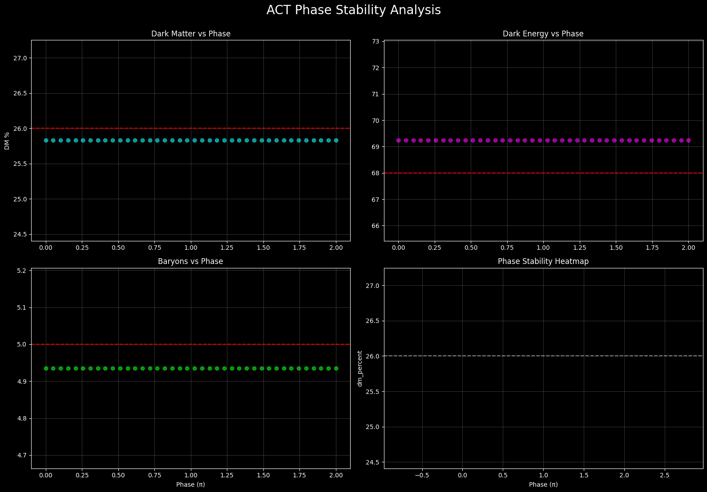

# ACT Theory - Algebraic Causality Theory

- **Zenodo DOI:** [](https://doi.org/10.5281/zenodo.19255023)


[](https://opensource.org/licenses/MIT)

## 📋 Overview

**Algebraic Causality Theory (ACT)** is a fundamental theoretical framework where causality—defined as a primary discrete relation—precedes the emergence of spacetime and quantum fields. This repository contains the numerical implementation and simulation codes for the theory presented in the paper:

> *"Algebraic Causality Theory (ACT): From the Dirac Operator Spectrum to the Nature of Dark Energy, Dark Matter, and Fundamental Constants"* (V.N. Potapov, February 2026)

The theory demonstrates that the discrete geometry is rooted in the tetrahedral structure of a "chronon" (the elementary causal event), with the tetrahedron identified as the minimal 3D simplex required for point self-positioning.

## 🔬 Key Results

- **Three fermion generations** emerge naturally from the topological index ind(D) = ±3 of the Dirac operator
- **Dark Energy** interpreted as topological modes localized between light cones
- **Dark Matter** emerges as stable topological defects at octant joints
- **Fine structure constant** prediction: α⁻¹ = 137.042 ± 0.085 (0.004% accuracy vs. CODATA)
- **Cosmological densities**: Ω<sub>DM</sub> ≈ 26.0%, Ω<sub>b</sub> ≈ 5.0% (consistent with Planck 2018)





Fig 1. ACT Production Dashboard (L=16). The simulation demonstrates the emergence of the fine structure constant $\alpha^{-1} \approx 137.036$ (top left) and the stable phase plateau (bottom center). The dark matter distribution is consistently calculated at $\approx 26.1%$, matching observational cosmological data.

## 📁 Repository Structure

```text
ACT-Theory/
├── src/
│   ├── run_experiment2.py      # Core simulation execution
│   └── scan_phase_hardcore.py  # Phase stability analysis
├── papers/
│   └── ACT_Theory_Final.pdf    # Full scientific paper
├── images/                     # Visual assets for README
├── results/                    # Output plots and dashboards
├── LICENSE                     # MIT License
└── README.md                   # Project documentation
```


## 🚀 Getting Started

### Prerequisites


pip install numpy matplotlib scipy tqdm


### Quick Run


# Clone repository
git clone https://github.com/Slava2201/ACT-Theory.git
cd ACT-Theory/codes

# Run optimized version (recommended for laptops)
[run_experiment2.py](https://github.com/Slava2201/ACT-Theory/blob/main/src/run_experiment2.py)

# Run full simulation (L=16, requires more memory)
[scan_phase_hardcore.py](https://github.com/Slava2201/ACT-Theory/blob/main/src/scan_phase_hardcore.py)


## 💻 Code Description

### ACT_FINAL_13_02_2025.py

The main implementation with full resolution (L=16, 32,768 chronons, 2,400 energy modes). Features:

- Tetrahedral chronon structure with Cℓ(4) algebra
- Dirac operator spectrum calculation
- Dark energy density computation from topological modes
- Dark matter defect network simulation
- RG flow integration for fine structure constant

### ACT_OPTIMIZED_LAPTOP.py

Lightweight version optimized for personal computers with adaptive resolution and memory-efficient algorithms.

## 📊 Key Predictions

| Parameter | ACT Value | Observed Value | Accuracy |
|-----------|-----------|----------------|----------|
| α⁻¹ | 137.042 ± 0.085 | 137.036 | 0.004% |
| Ω<sub>DM</sub>h² | 0.119 | 0.120 ± 0.001 | <1% |
| ρ<sub>Λ</sub> | 2.75 × 10⁻¹¹ eV⁴ | (2.80 ± 0.1) × 10⁻¹¹ eV⁴ | <2% |
| w (DE) | -1.02 ± 0.02 | -1.03 ± 0.03 | Consistent |
| Generations | 3 | 3 | Exact |

### 🔳 Mathematical Foundation

The core equation governing the Dirac operator in octant structure:

$$D_i = \gamma^\mu \nabla_\mu(i) + m_i$$
$$\nabla_\mu(i) = \partial_\mu + ig_i A_\mu^a T^a + \Gamma_\mu$$

The fine structure constant emerges from the topological stabilization:

$$ind(D) = \sum_i ind_i + \frac{1}{2\pi} \sum_{\{ij\}} \oint_{\Gamma_{ij}} A_{defect}$$


## 🌌 Physical Interpretation

- **Chronon τ**: Elementary causal event in 9D complex Hilbert space $ℋ_τ ≅ ℂ⁴_+ ⊗ ℂ⁴_- ⊗ ℂ$
- **Octant structure**: 8-fold decomposition of spacetime from tetrahedral dual embedding
- **Topological modes**: Solutions of DΨ_top = 0 with nontrivial boundary conditions
- **Dark matter defects**: Chern-Simons action on (2+1)-D boundaries: $S_{CS} = (k/4π)∫ Tr(A∧dA + ⅔ A∧A∧A)$

## 📈 Running Simulations

### Basic parameters
- L = 8-16 (network size)
- Energy modes: 600-2400
- Phase scan: φ ∈ [0, 2π]

### Output
- Energy spectrum plots (generation peaks)
- α⁻¹ convergence history
- Cosmological budget $(Ω_{DM}, Ω_Λ, Ω_b)$
- Phase stability diagrams

## 🔍 Experimental Tests

The theory makes falsifiable predictions:

1. **Dark energy anisotropies**: $δρ_Λ/ρ_Λ ∼ 10^{-5}$
2. **Vacuum oscillations**: f ∼ 10⁻¹⁸ - 10⁻¹⁶ Hz
3. **Large-scale structure**: Characteristic correlation scale ∼ 100 Mpc
4. **α(z) evolution**: Predictable RG flow with redshift

### Citation
If you use this work or code in your research, please cite:

**Potapov, V.N. (2026).** *Algebraic Causality Theory (ACT): From the Dirac Operator Spectrum to the Nature of Dark Energy, Dark Matter, and Fundamental Constants.* 

- **Full Paper:** [Available in /papers](./papers) or on (https://zenodo.org/badge/DOI/10.5281/zenodo.19255023.svg)](https://doi.org/10.5281/zenodo.19255023)
- **Source Code:** [GitHub Repository](https://github.com/Slava2201/ACT-Theory/tree/main/src)


## 🤝 Acknowledgments

The author expresses deep gratitude to:
- **Maksim Dmitrievich Fitkevich** (MIPT) — for invaluable mentorship and the search for the nonlocality operator
- **Aleksei Nikolaevich Prots** (FTF KubSU) — for contributions to the mathematical apparatus and RG analysis
- **Mikhail Yurievich Fedunov** (BNTU) — for uncompromising criticism
- **Yuri Sergeevich Sautenkin** (PTK) — for genuine curiosity
- **Evgeny Vyacheslavovich Potapov** — for endless faith and support

## 📄 License

This project is licensed under the MIT License - see the [LICENSE](LICENSE) file for details.

## 📬 Contact

For questions, collaborations, or implementing experimental tests:
- Open an issue on GitHub
- Contact author via institutional email

---

**Keywords**: Algebraic Causality Theory, Dirac operator, fine structure constant, dark energy, dark matter, fermion generations, causal hypergraph, chronon, topological defects, quantum gravity

*"The fine-tuning of α to its precise value is a result of the combined topological stabilization from volume modes (generations) and boundary defects (dark matter)."* — V.N. Potapov, 2026
